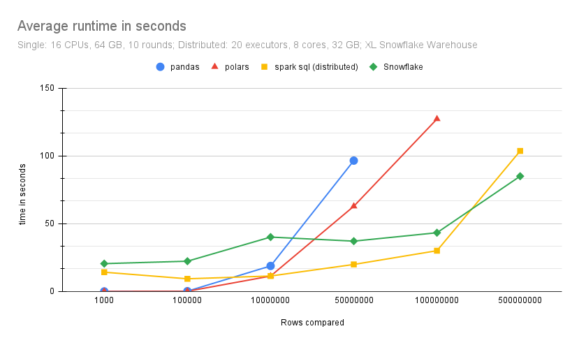

Benchmarks
==========

.. important::

    - Minimal tuning was done
    - Benchmarking is hard (and biased)
    - Take with a grain of salt

    
We've tried to create some benchmarks to help users understand which DataFrames to use when.
Please take the results with a grain of salt! If you have ideas on how we can further improve
preformance please make an issue, we always welcome contributions.

Setup used
----------

Single Machine:

- 16 CPUs
- 64GB RAM

Distributed Spark:

- 20 Executors
- 8 Cores
- 32GB RAM

The Data
---------

The data (base, and compare) we generated was purely synthetic consisting of 10 columns:

- 1 id (montonicly increasing) column used for joining
- 3 string columns 
- 6 numeric columns

Table of mean benchmark times in seconds:

===========   =======   =======    ===============   ===============   ===============        
Number of     pandas    polars     pandas on spark   spark (fugue)     spark (fugue) 
rows                               (distributed)     (single)          (distributed)        
===========   =======   =======    ===============   ===============   ===============       
1000          0.025     0.025      15.2838           2.041             1.109              
100,000       0.196     0.120      11.1113           1.743             3.175                 
10,000,000    18.804    11.330     20.6274           17.560            16.455                           
50,000,000    96.494    62.827     57.5735           90.578            94.304                          
100,000,000   DNR       127.194    96.3204           DNR               193.234          
500,000,000   DNR       DNR        262.6094          DNR               DNR            
===========   =======   =======    ===============   ===============   ===============        

.. note:: DNR = Did not run

TLDR
----

* Polars can handle a lot of data and is fast!
  
  * From our experiments we can see that on a 64GB machine it was able to process 100 Million records

* The Pandas on Spark implementation will be slower for small to mediumish data.

  * in the 100 Million + range is starts to shine, and due to its distributed 
    nature it can process vast amounts of data

* The native Pandas version is best for small and medium data
